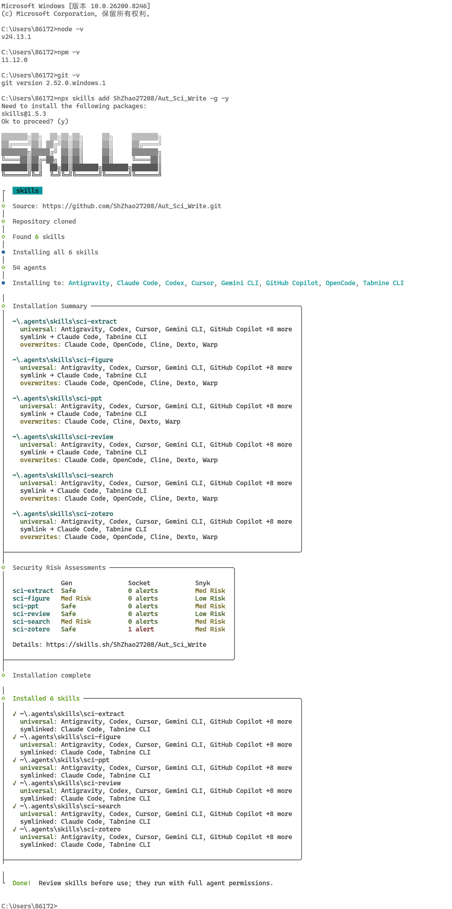

<div align="center">


# Aut_Sci_Write

**Autonomous Scientific Writer**

*A modular Claude Code Skills suite for the full academic research lifecycle*

[](LICENSE)
[](https://www.python.org/)
[](https://claude.ai/code)
[](https://github.com/omc-dev/oh-my-claudecode)
[](https://github.com/ShZhao27208/Aut_Sci_Write)

[🌐 Live Demo](https://shzhao27208.github.io/Aut_Sci_Write/) · [📦 Install](#-installation) · [📖 中文说明](#中文说明)

</div>

---

## English

**Aut_Sci_Write** is a modular collection of **AI Agent Skills** that automates the entire academic research and writing lifecycle — from literature discovery and deep PDF analysis to figure extraction, review writing, and professional PPT generation.

> Install once, use anywhere. Just talk to AI Agent naturally — the skills activate automatically based on what you say.


### ✨ What It Does

| Skill | Description | Example Trigger |
|:------|:------------|:----------------|
| `sci-search` | Search arXiv + PubMed + **Web of Science** simultaneously with JCR tier & impact factor data | /sci-search *Find high-IF papers on perovskite solar cells* |
| `sci-extract` | Extract core insights, experimental parameters, and conclusions from PDFs | /sci-extract  *Analyze the key findings of paper.pdf* |
| `sci-figure` | Auto-detect and crop figures from PDFs at 600 DPI, with subfigure splitting | /sci-figure *Extract Figure 3c from this paper* |
| `sci-review` | Draft literature reviews and professional peer-review rebuttals (NeurIPS/ICLR standard) | /sci-figure *Write a literature review on GNNs for drug discovery* |
| `sci-zotero` | Sync Zotero library, add citations by DOI/ISBN/PMID, fetch open-access PDFs | /sci-zotero *Connect to my Zotero database* |
| `sci-ppt` | Generate professional academic PPTX from paper PDFs or structured text, with LaTeX formula rendering | /sci-zotero *Turn this paper into a seminar presentation* |

### 🚀 Installation

**One-line install** (***Recommended*** — installs all 6 skills globally):

```bash
npx skills add ShZhao27208/Aut_Sci_Write -g -y
```

**Update to latest version:**

```bash
npx skills add ShZhao27208/Aut_Sci_Write -g -y
```

**Manual install** (clone and install Python dependencies):

```bash
git clone https://github.com/ShZhao27208/Aut_Sci_Write.git
cd Aut_Sci_Write
pip install -r requirements.txt
```

**OR**（Download/Clone to local and use the npm command）：

```bash
git clone https://github.com/ShZhao27208/Aut_Sci_Write.git
cd Aut_Sci_Write
npx skills add . -g -y
```




### ⚙️ Configuration

Set environment variables as needed:

```bash
# For sci-zotero (optional)
export ZOTERO_API_KEY=your_personal_api_key
export ZOTERO_USER_ID=your_numeric_user_id

# For sci-search — Web of Science (optional but recommended)
# Apply for a free key at: https://developer.clarivate.com/apis/wos-starter
export WOS_API_KEY=your_wos_api_key

# For sci-ppt PDF workflow (choose one)
export ANTHROPIC_API_KEY=sk-ant-...    # Claude API
export MOONSHOT_API_KEY=sk-...         # Moonshot API

# For sci-figure subfigure OCR (optional, Windows example)
export TESSERACT_CMD="C:\Program Files\Tesseract-OCR\tesseract.exe"
```

> Get your Zotero API key at: https://www.zotero.org/settings/keys
> Get your Web of Science API key at: https://developer.clarivate.com/apis

### 💬 Usage Examples

Once installed, just type naturally in AI Agent — no commands to memorize:

```
# Literature search
"/sci-search Search for recent papers on solid-state electrolytes for lithium batteries"

# Deep paper analysis
"/sci-extract Extract the core findings and experimental parameters from paper.pdf"

# Figure extraction
"/sci-figure Extract Figure 3 from paper.pdf and split subfigures a, b, c"

# PPT generation
"/sci-ppt Convert paper.pdf into a group meeting presentation, save as seminar.pptx"

# Literature review
"/sci-review Write a literature review on graph neural networks in drug discovery"

# Rebuttal writing
"/sci-review Help me respond to Reviewer 2's comment about missing baselines"

# Zotero sync
"/sci-zotero List the paper items from my Zotero 'Materials' collection"
```

### 📁 Repository Structure

```
Aut_Sci_Write/
├── skills/
│   ├── Aut_Sci_PPt/          # PPT generation engine (templates, layout, parser)
│   ├── sci-extract/          # PDF core content extraction
│   ├── sci-figure/           # Figure detection and cropping
│   ├── sci-review/           # Literature review & rebuttal writing
│   ├── sci-search/           # Paper search with journal metrics
│   └── sci-zotero/           # Zotero library integration
├── scripts/
│   ├── sci-search/
│   │   └── sci_search.py     # Search core logic
│   ├── extract_core_insights.py
│   ├── zotero.py
│   └── journal_db.json       # Journal metrics database (independently updatable)
├── examples/                 # Sample outputs (PDF + Markdown + PPT)
├── docs/                     # GitHub Pages site
└── requirements.txt
```

### 🤝 Contributing

Contributions welcome! Priority areas:
- Add journal metrics to `scripts/journal_db.json`
- Add writing templates to `skills/sci-review/templates/`
- Add new PPT slide types to `skills/Aut_Sci_PPt/src/aut_sci_ppt/templates/`
- Post problems you encounter  when using it to `issue`

---


## 中文说明

**Aut_Sci_Write** 是一套专为科研工作者设计的 **AI Agent Skills 技能包**，将科研写作的各个环节自动化，覆盖从文献发现到成果输出的完整链路。

> 安装一次，随处可用。直接用自然语言和 AI Agent 对话，技能会根据你说的内容自动激活。

### ✨ 功能概览

| 技能 | 功能描述 | 触发词示例 |
|------|----------|:----------|
| `sci-search` | arXiv + PubMed + **Web of Science** 三源检索，自动附加 JCR 分区和影响因子 | /sci-search *搜索钙钛矿太阳能电池最新论文* |
| `sci-extract` | 从 PDF 提取核心发现、实验参数、数值对比和主要结论 | /sci-extract *分析 paper.pdf 的核心结论* |
| `sci-figure` | 自动检测并裁剪论文图片（600 DPI），支持复合图拆分为子图 | /sci-figure *提取论文第3张图的子图* |
| `sci-review` | 文献综述写作 + 专业审稿回复，对标 NeurIPS/ICLR 标准 | /sci-review *帮我写图神经网络在药物发现中的综述* |
| `sci-zotero` | Zotero 文献库同步，支持 DOI/ISBN/PMID 添加引用，自动获取 PDF | /sci-zotero *连接我的zotero数据库* |
| `sci-ppt` | 从论文 PDF 或结构化文本一键生成学术 PPT，支持 LaTeX 公式渲染 | /sci-ppt *把这篇文献做成组会汇报PPT* |

### 🚀 安装方法

**一行命令安装**（***推荐***，将全部 6 个技能进行全局安装）：

```bash
npx skills add ShZhao27208/Aut_Sci_Write -g -y 
```

**更新到最新版本**（重新运行安装命令即可覆盖更新）：

```bash
npx skills add ShZhao27208/Aut_Sci_Write -g -y 
```

**手动安装**（克隆仓库并安装 Python 依赖）：

```bash
git clone https://github.com/ShZhao27208/Aut_Sci_Write.git
cd Aut_Sci_Write
pip install -r requirements.txt
```

**或者**（下载/克隆到本地使用npm命令）：

```bash
git clone https://github.com/ShZhao27208/Aut_Sci_Write.git
cd Aut_Sci_Write
npx skills add . -g -y
```

### 


### ⚙️ 环境变量配置

按需配置以下环境变量：

```bash
# sci-zotero 文献管理（可选）
export ZOTERO_API_KEY=你的个人API密钥
export ZOTERO_USER_ID=你的Zotero数字用户ID

# sci-search Web of Science 检索（可选，强烈推荐）
# 免费申请地址：https://developer.clarivate.com/apis/wos-starter
export WOS_API_KEY=你的WoS_API密钥

# sci-ppt 论文工作流（选择其一）
export ANTHROPIC_API_KEY=sk-ant-...    # Claude API
export MOONSHOT_API_KEY=sk-...         # Moonshot API（国内推荐）

# sci-figure 子图 OCR 识别（可选）
# Windows 示例：
export TESSERACT_CMD="C:\Program Files\Tesseract-OCR\tesseract.exe"
```

> Zotero API Key 获取地址：https://www.zotero.org/settings/keys
> Web of Science API Key 申请地址：https://developer.clarivate.com/apis

### 💬 使用示例

安装后直接在AI Agent 中用自然语言对话，无需记忆命令：

```
# 文献检索
"/sci-search 搜索关于锂离子电池固态电解质的高影响因子论文"

# 深度论文解析
"/sci-extract 分析 paper.pdf 的核心发现，提取实验参数和主要结论"

# 图表提取
"/sci-figure 从 paper.pdf 中提取 Figure 3 并拆分子图 a、b、c"

# 生成 PPT
"/sci-ppt 把 paper.pdf 做成组会汇报PPT，输出到 seminar.pptx"

# 文献综述
"/sci-review 帮我写一篇关于图神经网络在药物发现中应用的文献综述"

# 审稿回复
"/sci-review 帮我回复审稿人2关于缺少基线对比实验的意见"

# Zotero 同步
"/sci-zotero 列出我 Zotero 中 Materials 文件夹的文献条目"
```

### 📁 项目结构

```
Aut_Sci_Write/
├── skills/
│   ├── Aut_Sci_PPt/          # PPT 生成引擎（模板、布局、解析器）
│   ├── sci-extract/          # PDF 核心内容提取
│   ├── sci-figure/           # 论文图表检测与裁剪
│   ├── sci-review/           # 综述写作与审稿回复
│   ├── sci-search/           # 文献检索与期刊指标
│   └── sci-zotero/           # Zotero 文献库集成
├── scripts/
│   ├── sci-search/
│   │   └── sci_search.py     # 检索核心逻辑
│   ├── extract_core_insights.py
│   ├── zotero.py
│   └── journal_db.json       # 期刊指标数据库（可独立更新）
├── examples/                 # 示例输出（PDF + Markdown + PPT）
├── docs/                     # GitHub Pages 展示页
└── requirements.txt
```

### 🤝 贡献指南

欢迎贡献！优先方向：
- 在 `scripts/journal_db.json` 中补充期刊指标数据
- 在 `skills/sci-review/templates/` 中添加新的写作模板
- 在 `skills/Aut_Sci_PPt/src/aut_sci_ppt/templates/` 中新增 PPT 页面类型
- 在`issue`中提出自己遇到的问题

---

## 📄 License

MIT License — see [LICENSE](LICENSE)
