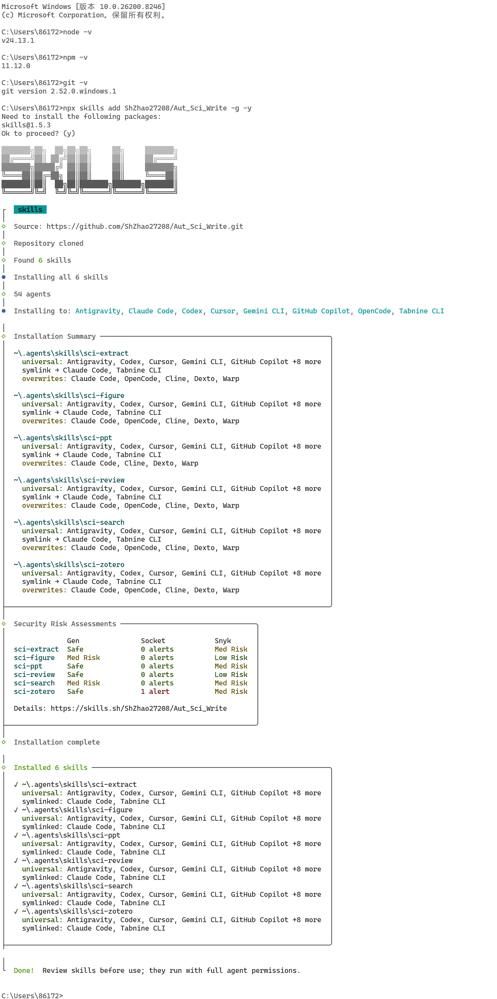

<div align="center">


# Aut_Sci_Write

**Autonomous Scientific Writer**

*A modular Agent Skills suite for the full academic research lifecycle*

[](package.json)
[](#-what-it-does)
[](#-what-it-does)
[](#-what-it-does)
[](https://www.python.org/)
[](https://nodejs.org/)
[](#-what-it-does)
[](#-what-it-does)
[](LICENSE)
[](https://github.com/ShZhao27208/Aut_Sci_Write)

[🌐 Live Demo](https://shzhao27208.github.io/Aut_Sci_Write/) · [📦 Install](#-installation) · [📖 中文说明](#中文说明)

</div>

---

## English

**Aut_Sci_Write** is a modular collection of **AI Agent Skills** that automates the entire academic research and writing lifecycle — from literature discovery and deep PDF analysis to figure extraction, review writing, and professional PPT generation.

> Install once, use anywhere. Just talk to AI Agent naturally — the skills activate automatically based on what you say.


### ✨ What It Does

| Skill | Description | Example Trigger |
|:------|:------------|:----------------|
| `sci-search` | Search arXiv + PubMed + **Web of Science** + **Elsevier** +**Springer** +  Semantic Scholar + OpenAlex simultaneously with JCR tier & impact factor data | /sci-search *Find high-IF papers on perovskite solar cells* |
| `sci-download` | Download paper PDFs with intelligent DOI routing across 8 sources:  **Elsevier**, **Springer**, IEEE, arXiv, Unpaywall, Semantic Scholar, PubMed Central, CNKI | /sci-download *Download 10.1038/s41586-023-06600-9* |
| `sci-extract` | Extract core insights from PDFs; **Paper Harvester** fetches full text + figures from DOI/PMID/arXiv with multi-source fallthrough, degraded capture handling, and extraction status badges | /sci-extract  *Analyze the key findings of paper.pdf* |
| `sci-figure` | Auto-detect and crop figures from PDFs at 600 DPI, with subfigure splitting | /sci-figure *Extract Figure 3c from this paper* |
| `sci-review` | Draft literature reviews and professional peer-review rebuttals (NeurIPS/ICLR standard) | /sci-figure *Write a literature review on GNNs for drug discovery* |
| `sci-zotero` | Sync Zotero library, add citations by DOI/ISBN/PMID, fetch open-access PDFs | /sci-zotero *Connect to my Zotero database* |
| `sci-ppt` | Generate professional academic PPTX from paper PDFs or structured text, with LaTeX formula rendering | /sci-zotero *Turn this paper into a seminar presentation* |
| `sci-html` | Convert PDFs, Markdown, outlines, or summaries into interactive academic HTML slide decks and browser reports. | /sci-html Turn this paper into an interactive HTML report |
| `sci-polish` | Two-stage academic paper polishing: AI detection reduction + 8-dimension quality improvement (grammar, tone, coherence, conciseness, terminology, structure, clarity, journal compliance) | /sci-polish *Polish this paper for NeurIPS submission* |

#### 🔌 API 

| Data Source | API Endpoint | Auth | Doc |
|:------------|:-------------|:-----|:----|
| Web of Science | `https://api.clarivate.com/apis/wos-starter/v1/documents` | `WOS_API_KEY` (header `X-ApiKey`) | [developer.clarivate.com](https://developer.clarivate.com/apis/wos-starter) |
| Springer Nature (Meta) | `https://api.springernature.com/meta/v2/json` | `SPRINGER_API_KEY` (query param `api_key`) | [dev.springernature.com](https://dev.springernature.com/) |
| Springer Nature (OA) | `https://api.springernature.com/openaccess/json` | `SPRINGER_OA_API_KEY` (query param `api_key`) | [dev.springernature.com](https://dev.springernature.com/) |
| Scopus (Elsevier) | `https://api.elsevier.com/content/search/scopus` | `SCOPUS_API_KEY` (header `X-ELS-APIKey`) | [dev.elsevier.com](https://dev.elsevier.com/) |
| Elsevier Article | `https://api.elsevier.com/content/article/doi/{doi}` | `ELSEVIER_API_KEY` + optional `ELSEVIER_INSTTOKEN` | [dev.elsevier.com](https://dev.elsevier.com/) |
| Semantic Scholar | `https://api.semanticscholar.org/graph/v1/paper/search` | Optional `SEMANTIC_SCHOLAR_API_KEY` (header `x-api-key`) | [semanticscholar.org/product/api](https://www.semanticscholar.org/product/api) |
| OpenAlex | `https://api.openalex.org/works` | Optional `OPENALEX_EMAIL` (query param `mailto`) | [docs.openalex.org](https://docs.openalex.org/) |
| PubMed (NCBI E-utils) | `https://eutils.ncbi.nlm.nih.gov/entrez/eutils/esearch.fcgi` | Optional `NCBI_API_KEY` + `NCBI_EMAIL` | [ncbi.nlm.nih.gov](https://www.ncbi.nlm.nih.gov/books/NBK25497/) |
| Europe PMC | `https://www.ebi.ac.uk/europepmc/webservices/rest/search` | None | [europepmc.org/RestfulWebService](https://europepmc.org/RestfulWebService) |
| CrossRef | `https://api.crossref.org/works` | None (optional `mailto` for polite pool) | [crossref.org/documentation](https://www.crossref.org/documentation/retrieve-metadata/rest-api/) |
| Unpaywall | `https://api.unpaywall.org/v2/{doi}` | `UNPAYWALL_EMAIL` (query param `email`) | [unpaywall.org/products/api](https://unpaywall.org/products/api) |
| IEEE Xplore | `https://ieeexploreapi.ieee.org/api/v1/search/articles` | `IEEE_API_KEY` (query param `apikey`) | [developer.ieee.org](https://developer.ieee.org/) |
| arXiv | `https://export.arxiv.org/api/query` | None | [info.arxiv.org/help/api](https://info.arxiv.org/help/api/) |
| Zotero | `https://api.zotero.org` | `ZOTERO_API_KEY` (header `Zotero-API-Key`, v3) | [zotero.org/support/dev/web_api](https://www.zotero.org/support/dev/web_api/v3/start) |

### 🚀 Installation

**Prerequisites**

Before installation, make sure the following environments are available:

- **Python 3.10+**: required for Python-based skills such as `sci-search`, `sci-extract`, `sci-figure`, `sci-review`, and `sci-ppt`
- **Node.js 18+**: required for `npx skills add ...` installation and CLI-based skill registration
- **pip**: used to install Python dependencies from `requirements.txt`

### ***Then*** choose **one** of the following methods:

#### Method 1: Claude Code Plugin (Recommended)

No prerequisites needed — the plugin system handles everything.

```bash
# Add the marketplace (one-time)
/plugin marketplace add ShZhao27208/Aut_Sci_Write

# Install the plugin
/plugin install academic-skills@shuozhao
```

Update to latest version:
```bash
/plugin update academic-skills@shuozhao
```

#### Method 2: npx CLI

**One-line install** (***Recommended*** — installs all 9 skills globally):

```bash
npx skills add ShZhao27208/Aut_Sci_Write -g -y
```

**Update to latest version:**

```bash
npx skills add ShZhao27208/Aut_Sci_Write -g -y
```

> After npx install, you still need Python dependencies for the skills to run:
> ```bash
> pip install -r requirements.txt
> ```

#### Method 3: Manual Install (Download/Clone to local)

```bash
git clone https://github.com/ShZhao27208/Aut_Sci_Write.git
cd Aut_Sci_Write
npx skills add . -g -y
pip install -r requirements.txt
```

#### Method 4: Docker (Isolated Environment)

Requires: **Docker** — no Python/Node.js needed locally.

```bash
git clone https://github.com/ShZhao27208/Aut_Sci_Write.git
cd Aut_Sci_Write
docker-compose build
docker-compose up -d
```

See [DOCKER.md](DOCKER.md) for detailed Docker deployment guide.

> **⚠️ Troubleshooting: PromptScript error**
>
> If you see errors like `✗ sci-extract → PromptScript: PromptScript does not support global skill installation` after a recent `skills` CLI update, **don't worry — the installation has already completed successfully**. This error only affects PromptScript (an unsupported target platform) and does not impact Claude Code or other AI agents.
>
> To avoid this message, simply remove the `-g` flag:
>
> ```bash
> npx skills add ShZhao27208/Aut_Sci_Write -y
> ```
>
> Or for local installs:
>
> ```bash
> npx skills add . -y
> ```

### ⚙️ Configuration

On first use, any skill will automatically create `~/.aut_sci_write/.env` with a template of all supported keys. Open it and fill in the ones you need:

```bash
# ~/.aut_sci_write/.env — unified config for all skills

# ─── sci-search ───────────────────────────────────────────────
# Web of Science Starter API (free): https://developer.clarivate.com/apis/wos-starter
WOS_API_KEY=
# Elsevier Scopus API (free): https://dev.elsevier.com/
SCOPUS_API_KEY=
# Springer Nature Metadata API (free): https://dev.springernature.com/
SPRINGER_API_KEY=
# Springer Nature Open Access API (falls back to SPRINGER_API_KEY)
SPRINGER_OA_API_KEY=
# Semantic Scholar (optional, for higher rate limits): https://www.semanticscholar.org/product/api#api-key
SEMANTIC_SCHOLAR_API_KEY=
# OpenAlex polite pool (optional, just your email)
OPENALEX_EMAIL=

# ─── sci-download ─────────────────────────────────────────────
# Elsevier Article Retrieval API (free): https://dev.elsevier.com/
ELSEVIER_API_KEY=
ELSEVIER_INSTTOKEN=
# IEEE Xplore API (free tier): https://developer.ieee.org/
IEEE_API_KEY=
# Unpaywall (just your email): https://unpaywall.org/products/api
UNPAYWALL_EMAIL=

# ─── sci-search & sci-download (shared) ──────────────────────
# NCBI/PubMed E-utilities (free): https://www.ncbi.nlm.nih.gov/account/settings/
NCBI_API_KEY=
NCBI_EMAIL=

# ─── sci-zotero ──────────────────────────────────────────────
# Zotero API key: https://www.zotero.org/settings/keys/new
ZOTERO_API_KEY=
# Numeric user ID (for personal library)
ZOTERO_USER_ID=
# Numeric group ID (for group library, use instead of USER_ID)
ZOTERO_GROUP_ID=

# ─── sci-ppt (optional AI parser) ────────────────────────────
ANTHROPIC_API_KEY=sk-ant-...    # Claude API
OPENAI_API_KEY=sk-...           # OpenAI fallback

# ─── sci-figure (optional subfigure OCR, Windows example) ────
TESSERACT_CMD="C:\Program Files\Tesseract-OCR\tesseract.exe"
```

Everything except `sci-ppt` and `sci-figure` works without any key — CrossRef, OpenAlex, Europe PMC, arXiv, and Semantic Scholar's anonymous tier need no credentials. Keys mainly unlock publisher-side full text and raise rate limits.

All skills share this single `.env` file — fill a key once, every skill that needs it will read from here. Do not commit or publish this file.

### 💬 Usage Examples

Once installed, just type naturally in AI Agent — no commands to memorize:

```
# Literature search
"/sci-search Search for recent papers on solid-state electrolytes for lithium batteries"

# Paper download
"/sci-download Download the PDF for DOI 10.1038/s41586-023-06600-9"

# Deep paper analysis
"/sci-extract Extract the core findings and experimental parameters from paper.pdf"

# Figure extraction
"/sci-figure Extract Figure 3 from paper.pdf and split subfigures a, b, c"

# Literature review
"/sci-review Write a literature review on graph neural networks in drug discovery"

# Rebuttal writing
"/sci-review Help me respond to Reviewer 2's comment about missing baselines"

# Zotero sync
"/sci-zotero List the paper items from my Zotero 'Materials' collection"

# PPT generation
"/sci-ppt Convert paper.pdf into a group meeting presentation, save as seminar.pptx"

# HTML report generation
"/sci-html Convert paper.pdf into an interactive browser-based academic report"

# Paper polishing (de-AI + 8-dimension quality)
"/sci-polish Polish this paper for NeurIPS submission, reduce AI detection rate"
```

### 📁 Repository Structure

```
Aut_Sci_Write/
├── skills/
│   ├── _shared/        # Unified env config module (env_config.py)
│   ├── sci-search/     # Literature search with journal metrics (7 sources)
│   ├── sci-download/   # Paper PDF download with intelligent DOI routing (8 sources)
│   ├── sci-extract/    # Paper analysis and structured insight extraction
│   ├── sci-figure/     # PDF figure and subfigure extraction
│   ├── sci-review/     # Literature review and rebuttal writing
│   ├── sci-ppt/        # Academic PPTX generation 
│   ├── sci-html/       # Interactive HTML reports and browser slide decks
│   ├── sci-polish/     # Academic paper polishing: de-AI + 8-dimension quality
│   └── sci-zotero/     # Zotero library integration
├── scripts/
│   ├── extract_core_insights.py  # Compatibility wrapper for sci-extract CLI
│   ├── zotero.py                 # Compatibility wrapper for sci-zotero CLI
│   └── journal_db.json           # Journal metrics database (independently updatable)
├── examples/                 # Sample outputs (PDF + Markdown + PPT)
├── docs/                     # GitHub Pages site
├── skills-cli.js       # Local skill discovery helper
└── requirements.txt    # Shared Python dependencies
```

### 🤝 Contributing

Contributions welcome! Priority areas:
- Add journal metrics to `scripts/journal_db.json`
- Add writing templates to `skills/sci-review/templates/`
- Add new PPT slide types to `skills/Aut_Sci_PPt/src/aut_sci_ppt/templates/`
- Post problems you encounter  when using it to `issue`

---


## 中文说明

**Aut_Sci_Write** 是一套专为科研工作者设计的 **AI Agent Skills 技能包**，将科研写作的各个环节自动化，覆盖从文献发现到成果输出的完整链路。

> 安装一次，随处可用。直接用自然语言和 AI Agent 对话，技能会根据你说的内容自动激活。

### ✨ 功能概览

| 技能 | 功能描述 | 触发词示例 |
|------|----------|:----------|
| `sci-search` | arXiv + PubMed + **Web of Science** + **Elsevier** +**Springer**  + Semantic Scholar + OpenAlex 七源检索，自动附加 JCR 分区和影响因子 | /sci-search *搜索钙钛矿太阳能电池最新论文* |
| `sci-download` | 论文 PDF 智能下载，根据 DOI 前缀自动路由到 **Elsevier**、**Springer**、IEEE、arXiv、Unpaywall、Semantic Scholar、PubMed Central,、知网 8 个数据源 | /sci-download *下载 10.1038/s41586-023-06600-9* |
| `sci-extract` | 从 PDF 提取核心发现、实验参数和结论；**Paper Harvester** 支持通过 DOI/PMID/arXiv 自动抓取全文+图片，多源 PDF 候选回退、降级抓取、提取状态标记 | /sci-extract *分析 paper.pdf 的核心结论* |
| `sci-figure` | 自动检测并裁剪论文图片（600 DPI），支持复合图拆分为子图 | /sci-figure *提取论文第3张图的子图* |
| `sci-review` | 文献综述写作 + 专业审稿回复，对标 NeurIPS/ICLR 标准 | /sci-review *帮我写图神经网络在药物发现中的综述* |
| `sci-zotero` | Zotero 文献库同步，支持 DOI/ISBN/PMID 添加引用，自动获取 PDF | /sci-zotero *连接我的zotero数据库* |
| `sci-ppt` | 从论文 PDF 或结构化文本一键生成学术 PPT，支持 LaTeX 公式渲染 | /sci-ppt *把这篇文献做成组会汇报PPT* |
| `sci-html` | 将论文 PDF、Markdown、大纲或总结转换为可交互的 HTML 学术报告或浏览器幻灯片。 | /sci-html 把这篇论文做成网页版交互报告 |
| `sci-polish` | 两阶段学术论文润色：降低 AI 检测率 + 八维质量提升（语法、语调、连贯性、简洁性、术语、结构、论证、期刊合规） | /sci-polish *帮我润色这篇论文，目标投 NeurIPS* |

#### 🔌 API 

| 数据源               | API 接口地址                                              | 认证方式                                          | 文档 |
| :------------------- | :-------------------------------------------------------- | :------------------------------------------------ | :--- |
| Web of Science       | `https://api.clarivate.com/apis/wos-starter/v1/documents` | `WOS_API_KEY`（header `X-ApiKey`）                | [developer.clarivate.com](https://developer.clarivate.com/apis/wos-starter) |
| Springer Nature (Meta) | `https://api.springernature.com/meta/v2/json`          | `SPRINGER_API_KEY`（query `api_key`）             | [dev.springernature.com](https://dev.springernature.com/) |
| Springer Nature (OA) | `https://api.springernature.com/openaccess/json`         | `SPRINGER_OA_API_KEY`（query `api_key`）          | [dev.springernature.com](https://dev.springernature.com/) |
| Scopus (Elsevier)    | `https://api.elsevier.com/content/search/scopus`         | `SCOPUS_API_KEY`（header `X-ELS-APIKey`）         | [dev.elsevier.com](https://dev.elsevier.com/) |
| Elsevier 全文        | `https://api.elsevier.com/content/article/doi/{doi}`     | `ELSEVIER_API_KEY` + 可选 `ELSEVIER_INSTTOKEN`   | [dev.elsevier.com](https://dev.elsevier.com/) |
| Semantic Scholar     | `https://api.semanticscholar.org/graph/v1/paper/search`  | 可选 `SEMANTIC_SCHOLAR_API_KEY`（header `x-api-key`） | [semanticscholar.org/product/api](https://www.semanticscholar.org/product/api) |
| OpenAlex             | `https://api.openalex.org/works`                         | 可选 `OPENALEX_EMAIL`（query `mailto`）           | [docs.openalex.org](https://docs.openalex.org/) |
| PubMed (NCBI E-utils)| `https://eutils.ncbi.nlm.nih.gov/entrez/eutils/esearch.fcgi` | 可选 `NCBI_API_KEY` + `NCBI_EMAIL`           | [ncbi.nlm.nih.gov](https://www.ncbi.nlm.nih.gov/books/NBK25497/) |
| Europe PMC           | `https://www.ebi.ac.uk/europepmc/webservices/rest/search`| 无需                                              | [europepmc.org/RestfulWebService](https://europepmc.org/RestfulWebService) |
| CrossRef             | `https://api.crossref.org/works`                         | 无需（可选 `mailto` 加速）                        | [crossref.org](https://www.crossref.org/documentation/retrieve-metadata/rest-api/) |
| Unpaywall            | `https://api.unpaywall.org/v2/{doi}`                     | `UNPAYWALL_EMAIL`（query `email`）                | [unpaywall.org/products/api](https://unpaywall.org/products/api) |
| IEEE Xplore          | `https://ieeexploreapi.ieee.org/api/v1/search/articles`  | `IEEE_API_KEY`（query `apikey`）                  | [developer.ieee.org](https://developer.ieee.org/) |
| arXiv                | `https://export.arxiv.org/api/query`                     | 无需                                              | [info.arxiv.org/help/api](https://info.arxiv.org/help/api/) |
| Zotero               | `https://api.zotero.org`                                 | `ZOTERO_API_KEY`（header `Zotero-API-Key`，v3）   | [zotero.org/support/dev/web_api](https://www.zotero.org/support/dev/web_api/v3/start) |

### 🚀 安装方法

**安装前提**

安装前请先确保本机已具备以下环境：

- **Python 3.10 及以上**：用于运行 `sci-search`、`sci-extract`、`sci-figure`、`sci-review`、`sci-ppt` 等基于 Python 的技能
- **Node.js 18 及以上**：用于执行 `npx skills add ...` 安装命令，以及完成 CLI 方式的技能注册
- **pip**：用于安装 `requirements.txt` 中的 Python 依赖

### 随后选择以下 **任一** 方式安装：

#### 方式 1：Claude Code 插件安装（推荐）

无需预装环境，插件系统自动处理依赖。

```bash
# 添加 marketplace（仅需一次）
/plugin marketplace add ShZhao27208/Aut_Sci_Write

# 安装插件
/plugin install academic-skills@shuozhao
```

更新到最新版本：
```bash
/plugin update academic-skills@shuozhao
```

#### 方式 2：npx 命令安装

**一行命令安装**（***推荐***，将全部 9 个技能进行全局安装）：

```bash
npx skills add ShZhao27208/Aut_Sci_Write -g -y 
```

**更新到最新版本**（重新运行安装命令即可覆盖更新）：

```bash
npx skills add ShZhao27208/Aut_Sci_Write -g -y 
```

> npx 安装后仍需安装 Python 依赖才能运行技能：
> ```bash
> pip install -r requirements.txt
> ```

#### 方式 3：手动安装（克隆/下载仓库到本地）

```bash
git clone https://github.com/ShZhao27208/Aut_Sci_Write.git
cd Aut_Sci_Write
npx skills add . -g -y
pip install -r requirements.txt
```

#### 方式 4：Docker 安装（隔离环境）

需要：**Docker** — 本地无需 Python/Node.js。

```bash
git clone https://github.com/ShZhao27208/Aut_Sci_Write.git
cd Aut_Sci_Write
docker-compose build
docker-compose up -d
```

详细的 Docker 部署指南请参考 [DOCKER.md](DOCKER.md)。

> **⚠️ 常见问题：PromptScript 报错**
>
> 如果安装后出现 `✗ sci-extract → PromptScript: PromptScript does not support global skill installation` 等错误，**无需担心，skills 已经安装成功**。此错误仅影响 PromptScript（一个不支持全局安装的目标平台），不影响 Claude Code 或其他 AI Agent 的正常使用。
>
> 如需消除此提示，去掉 `-g` 参数即可：
>
> ```bash
> npx skills add ShZhao27208/Aut_Sci_Write -y
> ```
>
> 或本地安装时：
>
> ```bash
> npx skills add . -y
> ```

### ⚙️ 配置说明

首次使用任意技能时，会自动创建 `~/.aut_sci_write/.env` 并写入所有支持的 API key 模板。打开该文件，按需填入：

```bash
# ~/.aut_sci_write/.env — 所有技能共用的统一配置文件

# ─── sci-search ───────────────────────────────────────────────
# Web of Science Starter API（免费）：https://developer.clarivate.com/apis/wos-starter
WOS_API_KEY=
# Elsevier Scopus API（免费）：https://dev.elsevier.com/
SCOPUS_API_KEY=
# Springer Nature Metadata API（免费）：https://dev.springernature.com/
SPRINGER_API_KEY=
# Springer Nature Open Access API（留空则回退到 SPRINGER_API_KEY）
SPRINGER_OA_API_KEY=
# Semantic Scholar（可选，提升速率限制）：https://www.semanticscholar.org/product/api#api-key
SEMANTIC_SCHOLAR_API_KEY=
# OpenAlex 礼貌池（可选，填邮箱即可）
OPENALEX_EMAIL=

# ─── sci-download ─────────────────────────────────────────────
# Elsevier 全文检索 API（免费）：https://dev.elsevier.com/
ELSEVIER_API_KEY=
ELSEVIER_INSTTOKEN=
# IEEE Xplore API（免费 tier）：https://developer.ieee.org/
IEEE_API_KEY=
# Unpaywall（填邮箱即可）：https://unpaywall.org/products/api
UNPAYWALL_EMAIL=

# ─── sci-search & sci-download（共用）────────────────────────
# NCBI/PubMed E-utilities（免费）：https://www.ncbi.nlm.nih.gov/account/settings/
NCBI_API_KEY=
NCBI_EMAIL=

# ─── sci-zotero ──────────────────────────────────────────────
# Zotero API key：https://www.zotero.org/settings/keys/new
ZOTERO_API_KEY=
# 个人库数字 ID
ZOTERO_USER_ID=
# 群组库 ID（与 USER_ID 二选一）
ZOTERO_GROUP_ID=

# ─── sci-ppt（可选 AI 解析）──────────────────────────────────
ANTHROPIC_API_KEY=sk-ant-...    # Claude API
OPENAI_API_KEY=sk-...           # OpenAI 备选

# ─── sci-figure（可选子图 OCR，Windows 示例）─────────────────
TESSERACT_CMD="C:\Program Files\Tesseract-OCR\tesseract.exe"
```

除 `sci-ppt` 和 `sci-figure` 外，大部分功能无需任何密钥即可使用 — CrossRef、OpenAlex、Europe PMC、arXiv 及 Semantic Scholar 匿名层均免配置。密钥主要用于解锁出版商全文和提升速率限制。

所有技能共享这一个 `.env` 文件 — 填写一次，所有需要该密钥的技能都会自动读取。请勿提交或公开此文件。

```bash
# 通过 DOI 抓取
python skills/sci-extract/harvest_paper.py 10.1016/j.mattod.2017.11.002

# 批量抓取
python skills/sci-extract/harvest_paper.py --batch dois.txt --output-dir ./papers

# 仅抓取元数据，跳过图片
python skills/sci-extract/harvest_paper.py 10.1038/nmat3173 --skip-figures
```

### 💬 使用示例

安装后直接在AI Agent 中用自然语言对话，无需记忆命令：

```
# 文献检索
"/sci-search 搜索关于锂离子电池固态电解质的高影响因子论文"

# 论文下载
"/sci-download 下载这篇论文 10.1038/s41586-023-06600-9"

# 深度论文解析
"/sci-extract 分析 paper.pdf 的核心发现，提取实验参数和主要结论"

# 图表提取
"/sci-figure 从 paper.pdf 中提取 Figure 3 并拆分子图 a、b、c"

# 文献综述
"/sci-review 帮我写一篇关于图神经网络在药物发现中应用的文献综述"

# 审稿回复
"/sci-review 帮我回复审稿人2关于缺少基线对比实验的意见"

# Zotero 同步
"/sci-zotero 列出我 Zotero 中 Materials 文件夹的文献条目"

# 生成 PPT
"/sci-ppt 把 paper.pdf 做成组会汇报PPT，输出到 seminar.pptx"

# 生成 HTML汇报
"/sci-html 将 paper.pdf 转换成交互式 HTML 学术报告"

# 论文润色（降AI率 + 八维提升）
"/sci-polish 帮我润色这篇论文，目标期刊是 IEEE TPAMI"
```

### 📁 项目结构

```
Aut_Sci_Write/
├── skills/
│   ├── _shared/              # 统一环境配置模块 (env_config.py)
│   ├── sci-search/           # 文献检索与期刊指标（7 源）
│   ├── sci-download/         # 论文 PDF 智能下载（8 源）
│   ├── sci-extract/          # 文献核心内容提取
│   ├── sci-figure/           # 论文图表检测与裁剪
│   ├── sci-review/           # 综述写作与审稿回复
│   ├── sci-ppt/              # PPT 生成引擎（模板、布局、解析器）
│   ├── sci-html/             # html交互式报告生成
│   ├── sci-polish/           # 论文润色：降AI率 + 八维质量提升
│   └── sci-zotero/           # Zotero 文献库集成
├── scripts/
│   ├── extract_core_insights.py  # sci-extract CLI 兼容包装
│   ├── zotero.py                 # sci-zotero CLI 兼容包装
│   └── journal_db.json       # 期刊指标数据库（可独立更新）
├── examples/                 # 示例输出（PDF + Markdown + PPT）
├── docs/                     # GitHub Pages 展示页
├── skills-cli.js             # 本地技能发现助手
└── requirements.txt        
```

### 🤝 贡献指南

欢迎贡献！优先方向：
- 在 `scripts/journal_db.json` 中补充期刊指标数据
- 在 `skills/sci-review/templates/` 中添加新的写作模板
- 在 `skills/Aut_Sci_PPt/src/aut_sci_ppt/templates/` 中新增 PPT 页面类型
- 在`issue`中提出自己遇到的问题



---

## 📄 License

MIT License — see [LICENSE](LICENSE)
